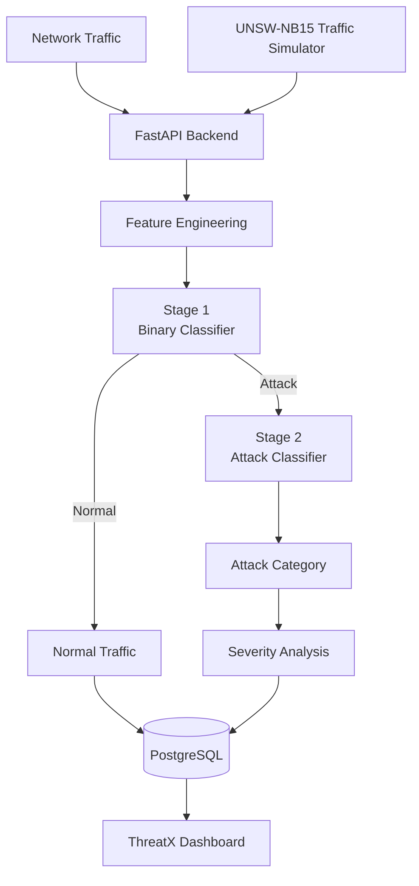
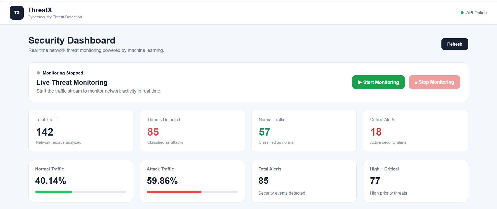
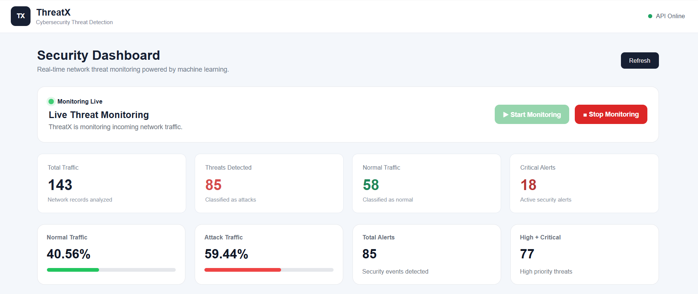
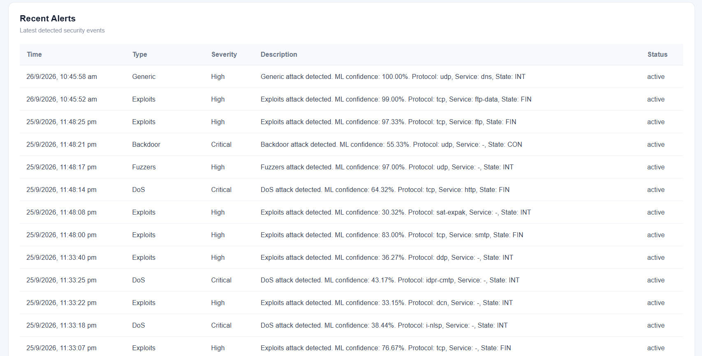
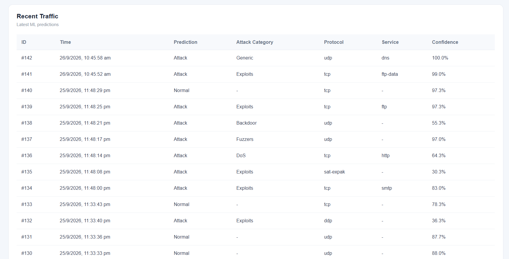
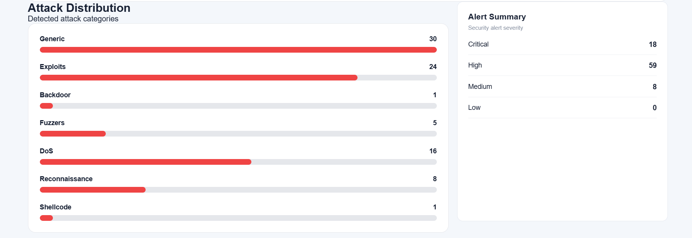
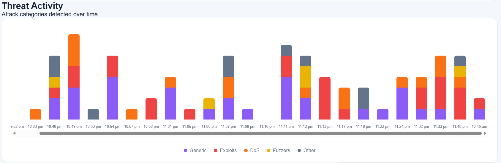
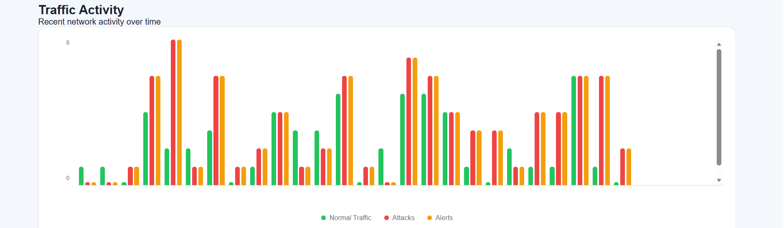

# ThreatX — ML-Based Cybersecurity Threat Detection System

ThreatX is a machine-learning-based cybersecurity monitoring system designed to detect suspicious network traffic, classify attack categories, generate security alerts, and visualize network activity through an interactive dashboard.

The project combines **machine learning, FastAPI, PostgreSQL, and a web-based dashboard** to create an end-to-end network threat detection workflow.

---

## Overview

Traditional network monitoring systems can generate large amounts of traffic information that can be difficult to analyze manually.

ThreatX addresses this by using a machine-learning pipeline to:

```text
Network Traffic
      ↓
Feature Engineering
      ↓
Threat Detection
      ↓
Attack Classification
      ↓
Severity Analysis
      ↓
Database Logging
      ↓
Security Dashboard
```

The system uses a hierarchical classification approach:

1. **Stage 1** — Detects whether traffic is Normal or an Attack.
2. **Stage 2** — Classifies the detected attack into a specific attack category.

---

## Features

* Machine-learning-based network threat detection
* Normal vs Attack classification
* Hierarchical attack-category classification
* Network-flow feature engineering
* UNSW-NB15 dataset integration
* Traffic simulation using network-flow records
* Automatic security alert generation
* Attack severity classification
* PostgreSQL database logging
* FastAPI REST backend
* Interactive cybersecurity dashboard
* Traffic activity monitoring
* Threat activity monitoring
* Attack distribution visualization
* Recent traffic and alert monitoring
* ML model evaluation and error-analysis scripts
* Separate GitHub Release for trained ML models

---

## System Architecture



---

# Machine Learning Pipeline

ThreatX uses the **UNSW-NB15** network intrusion dataset.

The machine-learning workflow consists of data exploration, preprocessing, feature engineering, model training, evaluation, error analysis, and hierarchical inference.

## Dataset

The UNSW-NB15 dataset contains network-flow records representing normal and malicious network activity.

ThreatX uses the dataset for:

* Model training
* Validation
* Evaluation
* Attack-category analysis
* Traffic simulation
* Error analysis

The dataset is not stored in the Git repository because of its size.

Expected local files:

```text
data/
├── UNSW_NB15_training-set.csv
└── UNSW_NB15_testing-set.csv
```

---

## Feature Engineering

ThreatX performs additional feature engineering to capture network-traffic behavior.

Examples include:

* Bytes per packet
* Packet rate
* Total bytes
* Total packets
* Byte ratio
* Packet ratio
* Load ratio
* Load difference
* Total packet loss
* Loss ratio
* Packet interval ratio
* Jitter ratio
* Mean packet difference
* Mean packet ratio
* TCP handshake time
* TTL difference
* TCP window difference
* Total handshake time

The feature-engineering logic is shared between the training and inference pipelines to maintain consistency.

---

# Hierarchical Classification

ThreatX uses two machine-learning stages.

## Stage 1 — Binary Threat Detection

The first model determines whether network traffic is:

```text
Normal
   OR
Attack
```

The Stage 1 model is a **Random Forest Classifier**.

### Validation Performance

| Metric    |  Score |
| --------- | -----: |
| Accuracy  | 97.41% |
| Precision | 98.20% |
| Recall    | 97.07% |
| F1 Score  | 97.63% |

### Evaluation on UNSW-NB15 Test Split

| Metric    |  Score |
| --------- | -----: |
| Accuracy  | 90.96% |
| Precision | 98.70% |
| Recall    | 87.87% |
| F1 Score  | 92.97% |

> These results are based on the UNSW-NB15 testing split used during development and experimentation.

---

## Stage 2 — Attack Classification

When Stage 1 identifies traffic as an attack, Stage 2 predicts the attack category.

Supported attack categories include:

* Generic
* Exploits
* Fuzzers
* DoS
* Reconnaissance
* Analysis
* Backdoor
* Shellcode
* Worms

### Validation Performance

| Metric             |  Score |
| ------------------ | -----: |
| Accuracy           | 80.48% |
| Weighted Precision | 80.12% |
| Weighted Recall    | 80.48% |
| Weighted F1        | 79.70% |

---

## End-to-End Prediction Flow

```text
Network Traffic
       ↓
Feature Engineering
       ↓
Stage 1 Classifier
       ↓
 ┌───────────────┐
 │               │
Normal         Attack
 │               │
 ↓               ↓
Log          Stage 2 Classifier
                 ↓
          Attack Category
                 ↓
          Severity Analysis
                 ↓
             Alert
                 ↓
            PostgreSQL
                 ↓
        ThreatX Dashboard
```

---

# Severity Classification

ThreatX assigns alert severity according to the detected attack category.

| Severity | Attack Categories          |
| -------- | -------------------------- |
| Critical | DoS, Backdoor, Shellcode   |
| High     | Exploits, Fuzzers, Generic |
| Medium   | Reconnaissance, Analysis   |
| Low      | Other detected categories  |

The severity is generated by the backend after the ML prediction.

---

# Traffic Simulation

ThreatX includes a traffic simulation service based on the UNSW-NB15 testing dataset.

The simulator:

1. Selects network-flow records.
2. Sends traffic records through the ML pipeline.
3. Generates predictions.
4. Stores prediction results.
5. Creates security alerts for detected attacks.
6. Updates the dashboard.

The simulation can be controlled from the dashboard.

```text
Start Monitoring
       ↓
Traffic Simulation
       ↓
ML Prediction
       ↓
Database Logging
       ↓
Dashboard Update
```

---

# Backend

The backend is implemented using **Python and FastAPI**.

It provides:

* REST API endpoints
* ML inference
* Feature preparation
* Traffic logging
* Alert generation
* Severity classification
* Dashboard statistics
* Analytics
* Traffic simulation controls
* PostgreSQL integration

## API Endpoints

### Health

```http
GET /api/health
```

Checks whether the backend is running.

### Prediction

```http
POST /api/predict
```

Analyzes a network-traffic record using the ThreatX ML pipeline.

The endpoint:

1. Receives network-flow features.
2. Performs feature engineering.
3. Runs Stage 1 classification.
4. Runs Stage 2 when an attack is detected.
5. Assigns severity.
6. Stores the prediction.
7. Creates an alert when required.

### Traffic

```http
GET /api/traffic
```

Returns recent traffic predictions.

### Alerts

```http
GET /api/alerts
```

Returns recent security alerts.

### Statistics

```http
GET /api/statistics
```

Returns dashboard statistics such as:

* Total traffic
* Normal traffic
* Attack traffic
* Alert counts

### Analytics

```http
GET /api/analytics
```

Returns traffic and threat analytics used by the dashboard.

### Simulation

```http
POST /api/simulation/start
```

Starts the traffic simulation.

```http
POST /api/simulation/stop
```

Stops the traffic simulation.

```http
GET /api/simulation/status
```

Returns the current simulation state.

---

# Database

ThreatX uses **PostgreSQL** with **SQLAlchemy**.

The database stores information related to:

### Traffic Logs

* Timestamp
* Prediction
* Attack category
* Confidence
* Protocol
* Service
* Connection state

### Security Alerts

* Timestamp
* Alert type
* Severity
* Description
* Status

This allows the dashboard to retrieve historical traffic and alert information.

---

# Frontend

The ThreatX dashboard is built using:

* HTML
* CSS
* Vanilla JavaScript

No frontend framework is required.

The dashboard provides:

* API status
* Monitoring controls
* Traffic statistics
* Threat statistics
* Normal vs attack distribution
* Traffic activity
* Threat activity
* Attack distribution
* Alert severity summary
* Recent alerts
* Recent traffic predictions

---

# Dashboard Preview

## Dashboard Overview



## Live Monitoring



## Recent Alerts



## Recent Traffic



## Security Alerts



## Threat Activity



## Traffic Activity



---

# Project Structure

```text
ThreatX/
│
├── backend/
│   ├── __init__.py
│   ├── create_tables.py
│   ├── database.py
│   ├── main.py
│   ├── model_service.py
│   ├── models.py
│   ├── simulator_service.py
│   └── test_database.py
│
├── frontend/
│   ├── app.js
│   ├── index.html
│   └── style.css
│
├── ml/
│   ├── analyze_attack_distribution.py
│   ├── analyze_confused_classes.py
│   ├── analyze_fuzzer_distribution.py
│   ├── analyze_fuzzer_errors.py
│   ├── analyze_fuzzer_similarity.py
│   ├── analyze_multiclass_errors.py
│   ├── analyze_test_errors.py
│   ├── check_quality.py
│   ├── evaluate_hierarchical_system.py
│   ├── evaluate_test.py
│   ├── explore_data.py
│   ├── feature_engineering.py
│   ├── inspect_data.py
│   ├── preprocess.py
│   ├── traffic_simulator.py
│   ├── train_balanced_rf.py
│   ├── train_baseline.py
│   ├── train_feature_engineered.py
│   ├── train_hierarchical_attack_classifier.py
│   ├── train_multiclass.py
│   ├── train_multiclass_balanced.py
│   ├── train_random_forest.py
│   └── train_targeted_feature_engineered.py
│
├── screenshots/
│   ├── dashboard-overview.png
│   ├── monitoring_live.png
│   ├── recent_alerts.png
│   ├── recent_traffic.png
│   ├── security_alerts.png
│   ├── threat_activity.png
│   └── traffic_activity.png
│
├── .gitignore
├── .python-version
├── README.md
└── requirements.txt
```

---

# Trained ML Models

The trained model files are excluded from the Git repository because of their large size.

The trained models are distributed through the **ThreatX GitHub Release**.

The release contains:

```text
targeted_feature_engineered_rf.pkl
hierarchical_attack_classifier.pkl
```

After downloading the models, place them locally in:

```text
ThreatX/
└── models/
    ├── targeted_feature_engineered_rf.pkl
    └── hierarchical_attack_classifier.pkl
```

The backend automatically loads the models when the FastAPI application starts.

---

# Technology Stack

| Layer               | Technology            |
| ------------------- | --------------------- |
| Frontend            | HTML, CSS, JavaScript |
| Backend             | Python, FastAPI       |
| Machine Learning    | Scikit-learn          |
| Models              | Random Forest         |
| Database            | PostgreSQL            |
| ORM                 | SQLAlchemy            |
| Dataset             | UNSW-NB15             |
| Model Serialization | Joblib                |
| API Documentation   | FastAPI Swagger       |
| Version Control     | Git & GitHub          |

---

# Local Setup

## 1. Clone the Repository

```bash
git clone https://github.com/debnathkaushik79-svg/ThreatX.git
cd ThreatX
```

## 2. Create Virtual Environment

On Windows PowerShell:

```powershell
python -m venv venv
```

Activate the environment:

```powershell
.\venv\Scripts\Activate.ps1
```

## 3. Install Dependencies

```powershell
pip install -r requirements.txt
```

## 4. Configure PostgreSQL

Create a `.env` file in the project root:

```env
DATABASE_URL=your_postgresql_connection_string
```

Do not commit database credentials or `.env` files to GitHub.

## 5. Prepare the Dataset

Place the UNSW-NB15 files locally:

```text
data/
├── UNSW_NB15_training-set.csv
└── UNSW_NB15_testing-set.csv
```

## 6. Download the ML Models

Download the trained models from the ThreatX GitHub Release.

Place them in:

```text
models/
├── targeted_feature_engineered_rf.pkl
└── hierarchical_attack_classifier.pkl
```

## 7. Start the Backend

From the project root:

```powershell
uvicorn backend.main:app --reload
```

The API will be available at:

```text
http://127.0.0.1:8000
```

FastAPI Swagger documentation:

```text
http://127.0.0.1:8000/docs
```

## 8. Start the Frontend

Open the `frontend` directory using a local development server.

For example, using VS Code Live Server:

```text
http://127.0.0.1:5501
```

The frontend communicates with the FastAPI backend to display traffic, threats, alerts, and analytics.

---

# ML Development Scripts

The `ml/` directory contains the scripts used throughout the machine-learning development process.

### Data Exploration

```text
explore_data.py
inspect_data.py
check_quality.py
```

Used for understanding dataset structure, feature quality, and data characteristics.

### Preprocessing

```text
preprocess.py
feature_engineering.py
```

Used for preparing network-flow data and generating engineered features.

### Model Training

```text
train_baseline.py
train_random_forest.py
train_balanced_rf.py
train_feature_engineered.py
train_targeted_feature_engineered.py
train_multiclass.py
train_multiclass_balanced.py
train_hierarchical_attack_classifier.py
```

These scripts represent the different model-development experiments performed during the project.

### Evaluation and Analysis

```text
evaluate_test.py
evaluate_hierarchical_system.py
analyze_attack_distribution.py
analyze_multiclass_errors.py
analyze_test_errors.py
analyze_confused_classes.py
analyze_fuzzer_distribution.py
analyze_fuzzer_errors.py
analyze_fuzzer_similarity.py
```

These scripts were used to evaluate model behavior and investigate classification errors and difficult attack classes.

---

# Limitations

* The system is based on the characteristics of the UNSW-NB15 dataset.
* The traffic simulator uses dataset records rather than live packet capture.
* Model performance may vary on real-world network traffic.
* Attack-category predictions depend on the hierarchical classification pipeline.
* The project is intended primarily for educational, research, and portfolio demonstration purposes rather than as a production intrusion-detection system.
* The reported metrics should be interpreted in the context of the dataset and development methodology.

---

# Future Improvements

Possible future extensions include:

* Live network packet capture
* Real-time network interface monitoring
* Additional intrusion-detection datasets
* Model explainability using SHAP
* Advanced anomaly detection
* Authentication and role-based access control
* More detailed security analytics
* Automated model retraining
* Model monitoring
* Production-oriented deployment and scaling

---

# Author

**Kaushik Debnath**

B.Tech Computer Science & Engineering

GitHub:
https://github.com/debnathkaushik79-svg

---

# License

This project is developed for educational, research, and portfolio purposes.
