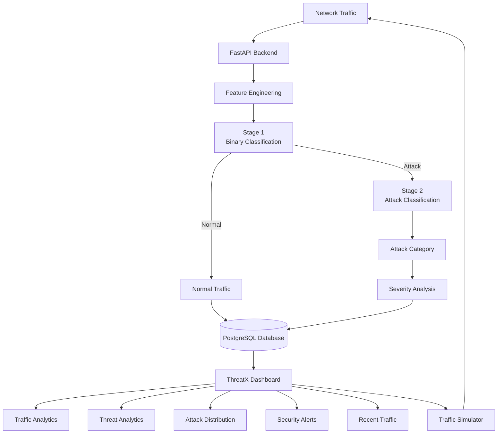
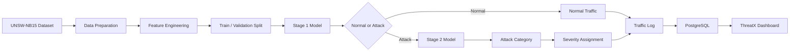
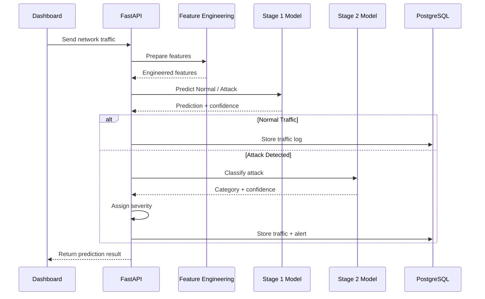

# ThreatX

## ML-Based Cybersecurity Threat Detection & Network Intrusion Monitoring System

ThreatX is an end-to-end machine-learning-based cybersecurity monitoring system that analyzes network traffic, detects potential threats, classifies attack categories, assigns security severity, and visualizes security events through an interactive dashboard.

The system combines **machine learning, feature engineering, REST APIs, database persistence, traffic simulation, and web-based monitoring** into a unified cybersecurity workflow.

---

## Overview

ThreatX processes network traffic through a two-stage machine learning architecture:

1. **Stage 1 — Threat Detection**

   * Determines whether network traffic is Normal or an Attack.

2. **Stage 2 — Attack Classification**

   * Classifies detected attacks into specific attack categories.

3. **Security Analysis**

   * Maps detected attack categories to appropriate severity levels.

4. **Data Persistence**

   * Stores traffic predictions and security alerts in PostgreSQL.

5. **Dashboard Monitoring**

   * Presents traffic activity, threats, alerts, attack distribution, and recent predictions through the ThreatX dashboard.

---

## System Architecture



---

## Machine Learning Pipeline



---

# Key Features

## 🔍 ML-Based Threat Detection

* Binary classification of network traffic
* Normal vs Attack detection
* Attack category classification
* Prediction confidence
* Network-flow feature engineering
* Hierarchical machine-learning architecture

## 🛡️ Security Monitoring

* Real-time traffic simulation
* Continuous ML prediction
* Attack detection
* Attack category identification
* Severity-based security alerts
* Recent traffic monitoring
* Security event tracking

## 📊 Security Dashboard

The ThreatX dashboard provides:

* Total traffic statistics
* Detected threat statistics
* Normal traffic statistics
* Critical alert count
* Normal vs attack distribution
* Traffic activity timeline
* Threat activity timeline
* Attack category distribution
* Alert severity summary
* Recent security alerts
* Recent ML predictions

## 🗄️ Database Integration

ThreatX uses PostgreSQL to persist monitoring information including:

* Traffic predictions
* Attack categories
* Prediction confidence
* Protocol
* Service
* Network state
* Security alerts
* Alert severity
* Alert descriptions
* Timestamps

---

# Attack Categories

The attack-classification pipeline supports attack categories represented in the UNSW-NB15 dataset:

* Generic
* Exploits
* Fuzzers
* DoS
* Reconnaissance
* Analysis
* Backdoor
* Shellcode
* Worms

---

# Threat Severity Classification

ThreatX maps detected attack categories to security severity levels.

| Severity | Attack Categories          |
| -------- | -------------------------- |
| Critical | DoS, Backdoor, Shellcode   |
| High     | Exploits, Fuzzers, Generic |
| Medium   | Reconnaissance, Analysis   |
| Low      | Other categories           |

This provides an additional security-analysis layer between ML predictions and dashboard alerts.

---

# Feature Engineering

ThreatX creates additional network-behavior features from the original network-flow attributes.

Examples include:

* Bytes per packet
* Packet rate
* Total bytes
* Total packets
* Byte ratio
* Packet ratio
* Load ratio
* Load difference
* Total packet loss
* Loss ratio
* Packet interval ratio
* Jitter ratio
* Mean packet difference
* Mean packet ratio
* TCP handshake time
* TTL difference
* TCP window difference
* Total handshake time

The feature-engineering module is shared between model development and backend inference to maintain consistency between training and prediction.

---

# Model Performance

## Stage 1 — Binary Threat Detection

### Validation Performance

| Metric    |  Score |
| --------- | -----: |
| Accuracy  | 97.41% |
| Precision | 98.20% |
| Recall    | 97.07% |
| F1 Score  | 97.63% |

### UNSW-NB15 Test Split

| Metric    |  Score |
| --------- | -----: |
| Accuracy  | 90.96% |
| Precision | 98.70% |
| Recall    | 87.87% |
| F1 Score  | 92.97% |

## Stage 2 — Attack Classification

### Validation Performance

| Metric             |  Score |
| ------------------ | -----: |
| Accuracy           | 80.48% |
| Weighted Precision | 80.12% |
| Weighted Recall    | 80.48% |
| Weighted F1 Score  | 79.70% |

These results provide a documented baseline for the current ML pipeline and support further experimentation with feature engineering, model selection, and class-level optimization.

---

# Prediction Workflow



---

# Dashboard

## Dashboard Overview


The main dashboard provides a centralized view of network activity, detected threats, normal traffic, active alerts, and monitoring status.

## Live Monitoring


The live monitoring interface continuously processes simulated network records through the ML pipeline.

## Traffic Activity


The traffic activity section provides a timeline-based view of recent network activity.

## Threat Activity


The threat activity section visualizes detected attack categories across the monitoring timeline.

## Security Alerts


Security alerts are organized according to their assigned severity.

## Recent Alerts


The recent alerts section displays the latest detected security events.

## Recent Traffic


The recent traffic section displays the latest ML predictions along with network information and prediction confidence.

---

# REST API

ThreatX uses FastAPI to expose the machine-learning and monitoring functionality through REST endpoints.

| Method | Endpoint                 | Description                           |
| ------ | ------------------------ | ------------------------------------- |
| GET    | `/`                      | API status                            |
| GET    | `/api/health`            | Health check                          |
| POST   | `/api/predict`           | Analyze network traffic               |
| GET    | `/api/traffic`           | Retrieve traffic records              |
| GET    | `/api/alerts`            | Retrieve security alerts              |
| GET    | `/api/statistics`        | Retrieve dashboard statistics         |
| GET    | `/api/analytics`         | Retrieve traffic and threat analytics |
| POST   | `/api/simulation/start`  | Start traffic simulation              |
| POST   | `/api/simulation/stop`   | Stop traffic simulation               |
| GET    | `/api/simulation/status` | Retrieve simulation status            |

---

# Technology Stack

## Frontend

* HTML5
* CSS3
* JavaScript
* Browser APIs

## Backend

* Python
* FastAPI
* Uvicorn
* Pydantic
* SQLAlchemy

## Machine Learning

* Python
* NumPy
* Pandas
* Scikit-learn
* Joblib

## Database

* PostgreSQL
* SQLAlchemy

## Dataset

* UNSW-NB15

## Development Tools

* Git
* GitHub
* VS Code
* Python Virtual Environment

---

# Project Structure

```text
ThreatX/
│
├── backend/
│   ├── main.py
│   ├── database.py
│   ├── models.py
│   ├── model_service.py
│   └── simulator_service.py
│
├── frontend/
│   ├── index.html
│   ├── app.js
│   └── style.css
│
├── ml/
│   ├── feature_engineering.py
│   └── ...
│
├── data/
│   ├── UNSW_NB15_training-set.csv
│   └── UNSW_NB15_testing-set.csv
│
├── models/
│   ├── targeted_feature_engineered_rf.pkl
│   └── hierarchical_attack_classifier.pkl
│
├── docs/
│
├── screenshots/
│   ├── dashboard-overview.png
│   ├── monitoring_live.png
│   ├── traffic_activity.png
│   ├── threat_activity.png
│   ├── security_alerts.png
│   ├── recent_alerts.png
│   └── recent_traffic.png
│
├── tests/
│
├── .gitignore
├── .python-version
├── requirements.txt
└── README.md
```

> The trained model files are excluded from Git tracking because of their size. The models are required locally to run the ML backend.

---

# Dataset

ThreatX uses the **UNSW-NB15** network intrusion dataset for machine-learning development and traffic simulation.

The dataset contains network-flow attributes representing normal network behavior and multiple categories of malicious traffic.

Dataset files are excluded from Git tracking because of their size.

Expected local files:

```text
data/
├── UNSW_NB15_training-set.csv
└── UNSW_NB15_testing-set.csv
```

---

# Installation & Local Setup

## 1. Clone the Repository

```bash
git clone https://github.com/debnathkaushik79-svg/ThreatX.git
cd ThreatX
```

## 2. Create a Virtual Environment

```powershell
python -m venv venv
```

Activate it:

```powershell
.\venv\Scripts\Activate.ps1
```

## 3. Install Dependencies

```powershell
pip install -r requirements.txt
```

## 4. Configure PostgreSQL

Create a `.env` file in the project root:

```env
DATABASE_URL=your_postgresql_connection_string
```

Keep database credentials private and never commit `.env` to GitHub.

## 5. Add the Trained Models

Place the trained model files inside:

```text
models/
├── targeted_feature_engineered_rf.pkl
└── hierarchical_attack_classifier.pkl
```

The model files are intentionally excluded from Git tracking because of their size.

## 6. Start the Backend

From the project root:

```powershell
uvicorn backend.main:app --reload
```

The API will run at:

```text
http://127.0.0.1:8000
```

Health check:

```text
http://127.0.0.1:8000/api/health
```

## 7. Start the Frontend

Serve the `frontend` directory using a local development server such as VS Code Live Server.

Example:

```text
http://127.0.0.1:5501
```

Open the dashboard and select **Start Monitoring** to begin the traffic simulation.

---

# Engineering Highlights

ThreatX brings together multiple areas of software engineering and machine learning:

* End-to-end ML inference pipeline
* Hierarchical classification architecture
* Reusable feature-engineering module
* FastAPI REST API development
* PostgreSQL database integration
* SQLAlchemy ORM
* Backend-driven dashboard statistics
* Automated traffic simulation
* Security alert generation
* Severity-based threat analysis
* Prediction confidence tracking
* Modular frontend JavaScript
* Environment-variable-based configuration
* Git-based version control
* Structured project architecture

---

# Future Enhancements

The current architecture provides a foundation for extending ThreatX with additional cybersecurity and machine-learning capabilities.

## Machine Learning

* Advanced ensemble models
* XGBoost-based experiments
* Hyperparameter optimization
* Cross-validation
* Model comparison and benchmarking
* Improved minority-class detection
* Advanced feature selection
* Explainable AI using SHAP

## Network Monitoring

* Live packet capture
* Network-interface integration
* Streaming traffic ingestion
* WebSocket-based real-time updates
* Protocol-level traffic analysis
* Continuous network monitoring

## Security Analytics

* Advanced historical analytics
* Threat filtering and search
* Attack trend analysis
* Custom time-range reports
* Security-event correlation
* Automated security reports

## Platform Development

* JWT authentication
* Role-based access control
* User-specific dashboards
* Alert acknowledgement workflows
* Audit logging
* Model version management

## Infrastructure

* Docker containerization
* Background task processing
* Scalable ML inference services
* Production-oriented database configuration
* Cloud deployment using infrastructure appropriate for ML workloads

These enhancements provide a roadmap for evolving ThreatX from a machine-learning cybersecurity project into a more comprehensive security monitoring platform.

---

# Project Objective

ThreatX was developed to demonstrate how **machine learning and software engineering can be combined to create an end-to-end cybersecurity monitoring workflow**.

The project integrates:

```text
Network Dataset
      ↓
Data Preparation
      ↓
Feature Engineering
      ↓
Machine Learning
      ↓
Threat Detection
      ↓
Attack Classification
      ↓
Severity Analysis
      ↓
Database Storage
      ↓
REST API
      ↓
Security Dashboard
```

Through this project, ThreatX demonstrates the integration of **machine-learning models, backend services, databases, APIs, traffic simulation, security analytics, and frontend visualization** into a unified application.

---

# Author

**Kaushik Debnath**

B.Tech Computer Science & Engineering

---

# License

This project is developed for educational, academic, portfolio, and research purposes.
